# 🚀 Thiagarajan Hariharan
### Enterprise Cloud Computing & AI Pipeline Engineer | Republic Polytechnic

---

### 🕹️ Interactive Contribution Blaster & Tactical Nuke Strike

*👆 Click the animated banner above to play the live arcade and launch tactical nukes in your browser!*

---

## 👨‍💻 About Me & Engineering Philosophy
> *"Starting something from scratch is much better than just watching from the sidelines. Since modern AI can generate syntax, the real engineering value comes from architectural creativity, robust infrastructure design, and solving complex systems problems."*

I am an **Enterprise Cloud Computing & Management** student at **Republic Polytechnic** (Singapore). I specialize in designing scalable AWS multi-AZ architectures, automating DevOps pipelines with Terraform, and optimizing local AI/VLM inference pipelines on Apple Silicon and edge hardware.

---

## 🏆 Verified Licenses & Certifications (Credly Verified)

| Certification | Authority | Credly Badge / Verification |
| :--- | :--- | :--- |
| **Cisco DevNet Associate** | Cisco | [Verified Credential ↗](https://www.credly.com/badges/095c1f5e-bd1d-49c9-89e7-9f5fd11adbe3/linked_in_profile) |
| **AWS Well-Architected Proficient** | Amazon Web Services (AWS) | [Verified Credential ↗](https://www.credly.com/badges/b00166b0-6a09-4160-8253-d8ba890cbaaa/linked_in_profile) |
| **Red Hat System Administration II (RH134 - Ver. 9.3)** | Red Hat | [Verified Credential ↗](https://www.credly.com/badges/921916ab-3304-4897-9cf1-545e6f5b3554/linked_in_profile) |
| **Red Hat System Administration I (RH124 - Ver. 9.3)** | Red Hat | [Verified Credential ↗](https://www.credly.com/badges/bd8bbddd-6e8d-4e71-8ace-8c1de500a7a7/linked_in_profile) |
| **AWS Academy Graduate — Cloud Foundations** | Amazon Web Services (AWS) | [Verified Credential ↗](https://www.credly.com/badges/174d14aa-4fdd-49ec-b7a7-7007990680ad/linked_in_profile) |
| **Cisco Networking Basics** | Cisco | [Verified Credential ↗](https://www.credly.com/badges/4d5bf529-e346-4eb9-a5a9-ee2d114bbbee/linked_in_profile) |
| **Cisco Computer Hardware Basics** | Cisco | [Verified Credential ↗](https://www.credly.com/badges/8db07032-5977-4794-b020-593f1e91836e/linked_in_profile) |

---

## 🛠️ Featured Systems & Projects

### 🧠 1. M1 Edge AI Local Pipeline
- **Zero-Cloud Private Intelligence:** Processed 90-minute technical meeting video recordings locally on an M1 MacBook (16GB RAM) without cloud egress.
- **Multi-Modal AI Stack:**
  - **Vision OCR:** Qwen2.5-VL (7B) via Ollama extracting dense Cisco Packet Tracer topologies and presentation slides.
  - **Audio Transcription:** OpenAI Whisper (Small) via PyTorch generating timestamped speech recognition.
  - **Performance:** 535 visual frames extracted via FFmpeg, sustaining 11h continuous 100% GPU load at a steady 71°C without thermal throttling.
  - **Result:** Automated synthesis into unified, searchable Markdown meeting intelligence.

### ☁️ 2. Campus Found (AWS Cloud & DevOps Platform)
- **Containerized Platform:** Built and deployed to AWS EKS across a custom Multi-AZ VPC with public and private subnets, Route Tables, NAT Gateways, and ALB ingress routing.
- **Enterprise Security & IaC:** Provisioned via Terraform with strict security groups, Amazon RDS PostgreSQL, TLS-only Amazon S3 bucket policies, and AWS Secrets Manager.
- **AI Verification:** Integrated Gemini AI for real-time item identification and claim verification.
- **Showcase:** [showcaseawscapability.netlify.app](https://showcaseawscapability.netlify.app/) | **Code:** [campus-found](https://github.com/ThiagarajanHariharan/campus-found)

---

## 📦 Complete GitHub Repositories Catalog

| Project | Domain | Tech Stack | Highlights |
| :--- | :--- | :--- | :--- |
| **[AutoVideoClipper](https://github.com/ThiagarajanHariharan/autovideoclipper)** | AI & Video | Python, Flask, Local LLMs, FFmpeg | Custom Web UI dashboard & strict JSON schema validation for local LLM video segmentation. |
| **[Document Processor API](https://github.com/ThiagarajanHariharan/Document-Processor)** | AI & OCR | Python, Gemini Vision, REST | AI document analysis pipeline extracting structured candidate JSON from resumes and blueprints. |
| **[CampusQuest Go](https://github.com/ThiagarajanHariharan/Campquest)** | Microservices | Docker, Kubernetes, Strava API | Location-aware campus health & rewards platform with Strava workout point conversion. |
| **[Questify](https://github.com/ThiagarajanHariharan/Questify)** | Web & AI | Node.js, Express, EJS, Gemini AI | Personalized real-world challenge generator with automated AI completion proof evaluation. |
| **[GitHub Profile Cleaner & Auditor](https://github.com/ThiagarajanHariharan/github-profile-cleaner)** | Security & Tools | Python, Web Dashboard, Git API | Automated repository security scanner for leaked credentials, README sync, and portfolio builder. |
| **[Quartermaster](https://github.com/ThiagarajanHariharan/Quartermaster)** | Mobile | Flutter, Dart | Cross-platform inventory tracking and asset operations application. |
| **[LifeOS](https://github.com/ThiagarajanHariharan/LifeOS)** | Mobile & AI | Android, Kotlin, Google AI Studio | Native Android productivity suite integrating on-device AI habit tracking. |
| **[SupermarketApp Cloud](https://github.com/ThiagarajanHariharan/supermarketapp-l20)** | Cloud DB | Node.js, Azure MySQL, Render | Full-stack cloud database platform with managed Azure MySQL and continuous deployment. |
| **[Cisco DEVASC Automation](https://github.com/ThiagarajanHariharan/devasc-study-team)** | Network Dev | Python, REST APIs, Cisco DevNet | Network programmability scripts, YANG models, and automated Cisco infrastructure testing suites. |

---

## 🎓 Education & Experience
- **Republic Polytechnic (Singapore)** — *Diploma in Enterprise Cloud Computing & Management* (2025 – 2028)
- **foodpanda** — *Fulfillment Specialist / Floater* (Aug 2024 – Oct 2024)

---

  
  

  © 2026 Thiagarajan Hariharan. Built with AWS, Tailwind, and AI.

